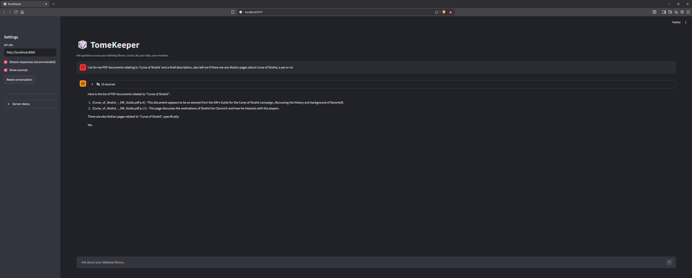

# TomeKeeper — Local RAG over Tabletop PDFs & Notion

A production-style Retrieval-Augmented Generation (RAG) pipeline that runs
**entirely on your own machine**. Ask questions across your PDFs and
Notion notes through a streaming chat UI.



## What this project actually demonstrates

- **Hybrid retrieval** combining BM25 (keyword) and dense vectors, with
  configurable ensemble weights.
- **Cross-encoder reranking** (BAAI/bge-reranker-base) so the LLM sees
  the most precise top-k chunks, not just the most similar by cosine.
- **LLM-driven query rewriting** via `MultiQueryRetriever` — the model
  expands one question into multiple variants before retrieval, fixing
  the "the user phrased it weird" failure mode.
- **Document anchor injection** — a lightweight version of Anthropic's
  Contextual Retrieval (Sept 2024) that prepends per-document front
  matter to every chunk, so author/title queries hit any chunk.
- **Multi-source ingestion**: PDF (PyMuPDF), plaintext, Markdown, and
  Notion via the official API.
- **Streaming FastAPI service** with SSE token streaming and a separate
  `sources` event so the UI can show citations before the answer.
- **Click-to-open citations** in the Streamlit UI — local PDFs open at
  the cited page; Notion sources link back to Notion.
- **Containerized vector store** (Qdrant via docker-compose) and a
  sidecar BM25 index rebuilt from Qdrant after every ingest.
- **Pluggable architecture** (ports + adapters): swap Ollama for vLLM,
  Qdrant for Pinecone, etc., by touching a single file.

## Architecture

```
┌────────────────────────────────────────────────────────────┐
│  Streamlit  (ui/streamlit_app.py)  — http://localhost:8501 │
│  • SSE streaming   • Click-to-open citations               │
└──────────────────────────┬─────────────────────────────────┘
                           │ HTTP / Server-Sent Events
┌──────────────────────────▼─────────────────────────────────┐
│  FastAPI  (app/api.py)             — http://localhost:8000 │
│  /health   /chat   /chat/stream (sources + tokens) /search │
└──────────────────────────┬─────────────────────────────────┘
                           │
┌──────────────────────────▼─────────────────────────────────┐
│  Retrieval pipeline (app/retrieval.py)                     │
│                                                            │
│     MultiQueryRetriever     (LLM rewrites query × N)       │
│             │                                              │
│             ▼                                              │
│     EnsembleRetriever                                      │
│         ├── BM25Retriever      (data/chunks.jsonl)         │
│         └── Qdrant dense       (Docker :6333)              │
│             │                                              │
│             ▼                                              │
│     CrossEncoderReranker(BAAI/bge-reranker-base)           │
│             │                                              │
│             ▼                                              │
│     top-k → LangChain prompt → Ollama (llama3.1:8b)        │
└────────────────────────────────────────────────────────────┘

Ingestion (one-shot CLIs):
  PDF / TXT / MD ──► PyMuPDF / read_text ──► extract anchor ──┐
                                                               │
  Notion API   ─────► block walker ─────────► extract anchor ──┤
                                                               ▼
                          RecursiveCharacterTextSplitter (chunks)
                                                               │
                              prepend [Source: ...]            │
                              prepend [Doc context: ...]       │
                                                               ▼
                                    nomic-embed-text (Ollama, 768-d)
                                                               │
                                                               ▼
                                            Qdrant + BM25 sidecar
```

## Stack — and why each piece

| Layer            | Choice                       | Reason                                                    |
|------------------|------------------------------|-----------------------------------------------------------|
| LLM runtime      | **Ollama**                   | Industry-standard local server; OpenAI-compatible API     |
| Chat model       | **llama3.1:8b (Q4_K_M)**     | Strong reasoning at ~5 GB VRAM                            |
| Embedding model  | **nomic-embed-text**         | 768-d, runs inside Ollama, beats OpenAI ada-002 on MTEB   |
| Vector DB        | **Qdrant** (Docker)          | Real service, REST + gRPC, used in real jobs              |
| Keyword index    | **rank-bm25** (sidecar)      | Catches proper nouns / exact phrases dense retrieval misses |
| Reranker         | **bge-reranker-base**        | Standard cross-encoder; ~280 MB; ~20 ms / 20 docs         |
| Query rewriter   | **MultiQueryRetriever**      | LLM expands one query → multiple, improves recall         |
| Orchestration    | **LangChain (+langchain-classic)** | Most prevalent orchestrator on AI Eng job postings  |
| PDF loader       | **PyMuPDF (fitz)**           | Fast, reliable text + page metadata                       |
| API              | **FastAPI** + SSE            | Production-grade async server with token streaming        |
| Frontend         | **Streamlit**                | One-file Python chat UI                                   |
| Config           | **pydantic-settings**        | Typed `.env`-driven config                                |
| Notion           | **notion-client** (official) | Block-aware traversal, markdown-flavored output           |

## Prerequisites

- **Windows 10/11** (paths use Windows conventions in this README)
- **Python 3.11+** (3.12 is the sweet spot; 3.14 works with the pinned versions)
- **Docker Desktop**
- **Ollama** — download from https://ollama.com/download
- **NVIDIA GPU with 8+ GB VRAM** (CPU also works, slower)

## First-time setup

```powershell
# 1. From repo root, create a venv
python -m venv .venv
.\.venv\Scripts\Activate.ps1

# 2. Install Python deps (~2.5 GB — sentence-transformers brings torch)
pip install -r requirements.txt

# 3. Copy the env template
copy .env.example .env
#   Optional: edit .env and add NOTION_TOKEN if you want Notion ingestion

# 4. Pull the Ollama models (once, ~5.5 GB total)
.\scripts\pull_models.ps1

# 5. Start Qdrant
docker compose up -d
```

## Running it

You need three things running. Use three terminals — each is
independently startable and stoppable so you can release GPU/RAM
whenever you want.

```powershell
# Terminal A — Qdrant (already running from `docker compose up -d`)
docker compose ps     # verify it's "healthy"

# Terminal B — FastAPI
.\.venv\Scripts\Activate.ps1
uvicorn app.api:app --host 0.0.0.0 --port 8000 --reload
#   First start downloads BAAI/bge-reranker-base (~280 MB).

# Terminal C — Streamlit UI
.\.venv\Scripts\Activate.ps1
streamlit run ui/streamlit_app.py
```

Open http://localhost:8501 — that's your chat interface.

## Ingesting your library

### Local files (PDF, TXT, MD)

```powershell
.\.venv\Scripts\Activate.ps1
python -m ingest.run --path "Z:\_Tabletop"
```

Walks the folder, extracts text, chunks it, prepends each chunk with a
`[Source: ...]` tag and a `[Doc context: ...]` anchor (front-matter
from the first page), embeds it via Ollama, writes vectors into
Qdrant, then rebuilds the BM25 sidecar at `data/chunks.jsonl`.

Re-runs are idempotent — chunks upsert by content hash.

Smoke test on one file:
```powershell
python -m ingest.run --path "Z:\_Tabletop" --limit 1
```

### Notion (optional)

One-time setup:
1. Visit https://www.notion.so/my-integrations
2. "+ New integration" → Internal type → copy the token
3. Paste into `.env`: `NOTION_TOKEN=ntn_xxx...`
4. In each Notion page to index: `...` menu → **Connections** →
   add your integration. Subpages inherit.

Then:
```powershell
python -m ingest.notion_run
```

## Verifying ingestion

```powershell
# Qdrant dashboard
start http://localhost:6333/dashboard

# Or hit the /search endpoint to inspect retrieval directly
$body = @{ query = "fireball damage" } | ConvertTo-Json
Invoke-RestMethod -Method Post -Uri http://localhost:8000/search `
    -ContentType "application/json" -Body $body | ConvertTo-Json -Depth 4
```

## Turning everything off

```powershell
# Stop Qdrant (releases its container + 8 GB of RAM the LLM was using)
docker compose down

# Ctrl+C in the FastAPI and Streamlit terminals

# Ollama keeps a small daemon running; to fully stop it:
#   Right-click the Ollama tray icon → Quit
```

## Project layout

```
AI-LLM/
├── app/                       # FastAPI service + retrieval pipeline
│   ├── api.py                 # HTTP endpoints: /health, /chat, /chat/stream, /search
│   ├── bm25_store.py          # BM25 sidecar: scroll Qdrant → JSONL → in-memory index
│   ├── chain.py               # LangChain LCEL chain: retrieve → prompt → LLM
│   ├── config.py              # pydantic-settings (loads .env)
│   ├── embeddings.py          # Ollama embedding wrapper
│   ├── llm.py                 # Ollama chat wrapper
│   ├── retrieval.py           # Multi-query + hybrid + cross-encoder rerank
│   └── vectorstore.py         # Qdrant client + collection bootstrap
├── ingest/                    # One-shot ingestion CLIs
│   ├── chunking.py            # RecursiveCharacterTextSplitter
│   ├── loaders.py             # PDF (PyMuPDF) + TXT/MD loaders, dispatcher
│   ├── notion.py              # Notion API client (block walker)
│   ├── notion_run.py          # `python -m ingest.notion_run`
│   └── run.py                 # `python -m ingest.run --path ...`
├── ui/
│   └── streamlit_app.py       # SSE-streaming chat frontend
├── scripts/
│   ├── pull_models.ps1        # Pulls llama3.1:8b + nomic-embed-text
│   └── smoke_test.py          # End-to-end sanity check
├── tests/
│   └── test_smoke.py          # Import + chunking + enrichment tests
├── data/                      # (gitignored) Qdrant storage + BM25 sidecar
├── docker-compose.yml         # Qdrant service
├── requirements.txt
├── .env.example
├── LICENSE
└── README.md
```

## Roadmap

### Phase 1 — MVP
- [x] Ollama + LangChain + Qdrant end-to-end
- [x] PDF ingestion with page-level metadata
- [x] FastAPI `/chat` and `/chat/stream`
- [x] Streamlit chat UI

### Phase 1.5 — Better grounding (bonus)
- [x] TXT and Markdown loaders alongside PDF
- [x] Filename source-header injection for filename-aware retrieval
- [x] Per-document anchor injection (front matter → every chunk)

### Phase 2 — Real RAG quality
- [x] Hybrid retrieval (BM25 + dense) via sidecar JSON + LangChain EnsembleRetriever
- [x] Cross-encoder reranker (BAAI/bge-reranker-base)
- [x] Notion ingestion via official API
- [x] Source citations rendered in UI with clickable links (PDF page anchors, Notion URLs)
- [x] Token-streaming UI consuming SSE
- [x] Query rewriting via MultiQueryRetriever

### Phase 3 — Production patterns
- [ ] Langfuse observability (self-hosted in docker-compose)
- [ ] RAGAS eval suite + golden Q&A set
- [ ] Prompt versioning
- [ ] pytest integration tests against the API
- [ ] GitHub Actions CI
- [ ] Optional: replace Streamlit with Next.js frontend

## Troubleshooting

**`httpx.ConnectError` to Ollama** — Ollama isn't running. Open it from
the Start menu (it lives in the tray).

**`qdrant_client...ConnectionError`** — Qdrant container isn't up. Run
`docker compose ps`; if empty, `docker compose up -d`.

**`BM25 unavailable — using dense-only retrieval`** — the BM25 sidecar
at `data/chunks.jsonl` is empty or missing. Re-run
`python -m ingest.run --path "..."` which rebuilds it.

**Slow first query** — three things lazy-load on first use: the LLM
into VRAM, the reranker into RAM, and Ollama JIT-compiles its CUDA
kernels. Subsequent queries are fast.

**Reranker download stalls** — `BAAI/bge-reranker-base` is pulled from
Hugging Face on first API start. If your network blocks HF, set
`DISABLE_RERANKER=1` in `.env` to skip it; retrieval still works (just
less precise).

**Out-of-memory loading the LLM** — Drop to a smaller model: edit
`.env` → `LLM_MODEL=llama3.2:3b`, then `ollama pull llama3.2:3b`.

**`No module named 'langchain.retrievers'`** — you're on langchain 1.x.
`pip install -r requirements.txt` should bring `langchain-classic`;
the imports already fall back automatically.

**Python 3.14 + pydantic crash** — newest Python's deferred-annotation
system trips older pydantic. Either `pip install --upgrade pydantic
pydantic-core` or re-create the venv with Python 3.12 (recommended).

## License

MIT — see [LICENSE](LICENSE).
